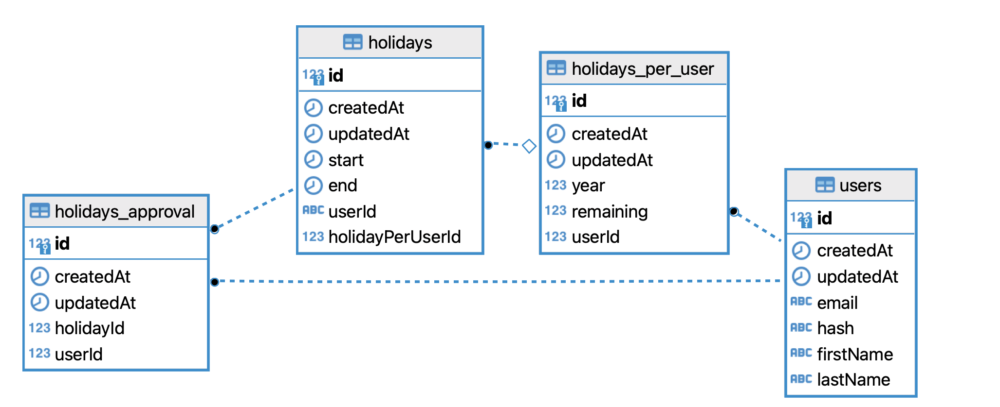

## Installation

```bash
npm install
```

## Running the app

```bash
# development
$ npm run start

# watch mode
$ npm run start:dev

# production mode
$ npm run start:prod
```

## Test

```bash
# unit tests
$ npm run test

# e2e tests
$ npm run test:e2e

# test coverage
$ npm run test:cov
```

## Models

### User - Holidays - Approval



## TODO

- [ ] Replace `object-hash` with `argon2` once is ready for M1
